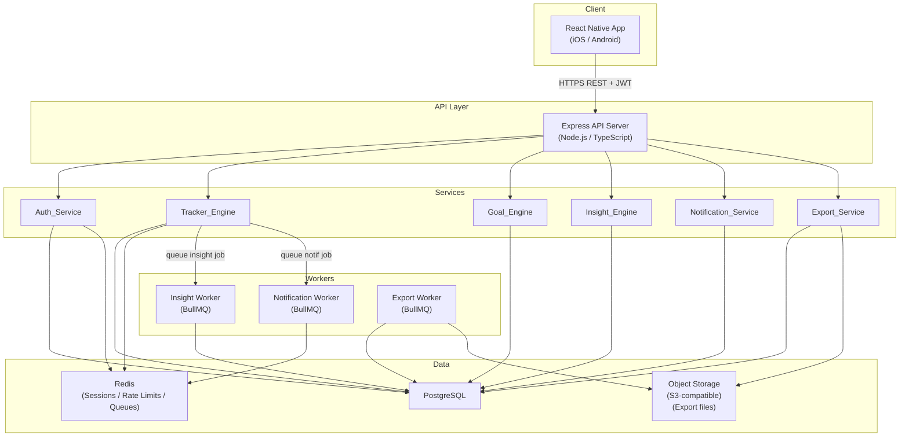

# Design Document — LifeTrack App

## Overview

LifeTrack is a cross-platform personal life tracking application. Users track habits, mood, health metrics, and goals from a unified dashboard. The design follows a client-server architecture: a React Native mobile app (iOS and Android) backed by a Node.js/TypeScript REST API, a PostgreSQL database, and supporting services for notifications, exports, and insight generation.

Key technical decisions:

- **React Native + Expo** for the mobile front-end, enabling code reuse across iOS and Android with a single TypeScript codebase.
- **Node.js + Express + TypeScript** for the API server, chosen for the large ecosystem, type safety, and easy async I/O.
- **PostgreSQL** as the primary store — JSONB columns for flexible Tracker value storage, with strong relational integrity for Users, Goals, and Entries.
- **Redis** for session tokens, rate-limit counters (password reset throttling), and pub/sub for real-time streak/notification events.
- **BullMQ** (backed by Redis) for background job queues: insight calculation, notification dispatch, large exports.
- **JWT + refresh-token** session model to satisfy the 30-day inactivity expiry requirement without per-request DB hits.
- **Property-based testing via fast-check** (TypeScript) for the business-logic layer (validation, streak calculation, progress formulas, export round-trips).

---

## Architecture



**Request flow:**

1. The mobile client sends authenticated requests (Bearer JWT) to the Express API.
2. Each route is handled by the corresponding service module.
3. Long-running work (insight recalc, notification dispatch, large exports) is enqueued as BullMQ jobs and executed by workers, decoupled from the request cycle.
4. Push notifications are delivered via FCM (Android) / APNs (iOS) through the Notification Worker.

---

## Components and Interfaces

### Auth_Service

Handles registration, login, session management, and password reset.

```typescript
interface RegisterRequest {
  email: string;       // max 254 chars, valid RFC 5321 local@domain.tld
  password: string;    // 8–128 chars
}

interface LoginRequest {
  email: string;
  password: string;
}

interface SessionTokens {
  accessToken: string;   // JWT, 15-min expiry
  refreshToken: string;  // opaque, stored in Redis, 30-day sliding expiry
}

interface PasswordResetRequest {
  email: string;
}

// Endpoints
POST /auth/register        -> SessionTokens | ValidationError
POST /auth/login           -> SessionTokens | AuthError
POST /auth/refresh         -> SessionTokens | AuthError
POST /auth/logout          -> 204
POST /auth/password-reset  -> 202 | RateLimitError
POST /auth/password-reset/confirm  -> 204 | ValidationError
```

**Session model:** Access tokens are short-lived (15 min). Refresh tokens are stored in Redis with a 30-day TTL that resets on each use (sliding expiry). When 30 days pass without a refresh, the token expires and the user must re-authenticate.

**Rate limiting:** Password reset requests are counted per email in Redis with a 60-minute expiry window. Attempts 4+ are rejected with `429 Too Many Requests`.

### Tracker_Engine

Manages Tracker lifecycle and Entry logging.

```typescript
type TrackerFrequency = 'daily' | 'weekly' | { intervalDays: number };
type TrackerDataType = 'numeric' | 'boolean' | 'text';

interface CreateTrackerRequest {
  name: string;            // 1–100 chars
  dataType: TrackerDataType;
  unit?: string;
  frequency: TrackerFrequency;
  categories?: string[];
  validRange?: { min: number; max: number }; // numeric only
  isHabit?: boolean;
  graceEnabled?: boolean;
}

interface LogEntryRequest {
  trackerId: string;
  value: number | boolean | string;
  note?: string;             // truncated server-side to 500 chars
  localTimestamp: string;    // ISO 8601, user's local time
  timezoneOffset: number;    // minutes from UTC
}

// Endpoints
POST   /trackers                 -> Tracker | ValidationError | LimitError
GET    /trackers                 -> Tracker[]
PATCH  /trackers/:id             -> Tracker | ValidationError
POST   /trackers/:id/archive     -> 204
DELETE /trackers/:id             -> 204 | ConflictError (if archived)
POST   /trackers/:id/entries     -> Entry | ValidationError | ConflictError
GET    /trackers/:id/entries     -> Entry[]  (query: start, end, limit, offset)
PATCH  /trackers/:id/entries/:eid -> Entry | ValidationError
```

### Goal_Engine

```typescript
type GoalDirection = 'ascending' | 'descending';
type GoalStatus = 'active' | 'completed' | 'expired';

interface CreateGoalRequest {
  trackerId: string;
  targetValue: number;
  direction: GoalDirection;
  deadline: string;    // ISO 8601 date YYYY-MM-DD
}

// Progress formula (ascending):  clamp((sumEntryValues / targetValue) * 100, 0, 100)
// Progress formula (descending): clamp((1 - (latestEntryValue / targetValue)) * 100, 0, 100)

// Endpoints
POST  /goals             -> Goal | ValidationError
GET   /goals             -> { active: Goal[]; completed: Goal[]; expired: Goal[] }
PATCH /goals/:id         -> Goal | ValidationError
```

### Insight_Engine

Insight generation runs as a background job triggered when a new Entry is saved.

```typescript
type TrendDirection = 'improving' | 'stable' | 'declining';

interface TrendInsight {
  type: 'trend';
  trackerId: string;
  direction: TrendDirection;  // slope > 0.05: improving; -0.05..0.05: stable; < -0.05: declining
  generatedAt: string;
}

interface CorrelationInsight {
  type: 'correlation';
  trackerIdA: string;
  trackerIdB: string;
  pearsonR: number;
  generatedAt: string;
}

// Endpoints
GET /insights   -> (TrendInsight | CorrelationInsight)[]  ordered by generatedAt desc
```

### Notification_Service

```typescript
interface ReminderConfig {
  trackerId: string;
  timeOfDay: string;       // HH:MM in user's local time
  daysOfWeek: number[];    // 0=Sun … 6=Sat
  enabled: boolean;
}

// Endpoints
POST   /reminders           -> ReminderConfig
GET    /reminders           -> ReminderConfig[]
PATCH  /reminders/:id       -> ReminderConfig
DELETE /reminders/:id       -> 204
PATCH  /reminders/global    -> { enabled: boolean }
```

### Export_Service

```typescript
type ExportFormat = 'csv' | 'json';

interface ExportRequest {
  format: ExportFormat;
  trackerId?: string;   // omit for all trackers
  startDate?: string;   // YYYY-MM-DD
  endDate?: string;     // YYYY-MM-DD
}

// Endpoints
POST /exports         -> { jobId: string } | ExportResult  (sync for ≤10k entries)
GET  /exports/:jobId  -> ExportResult  (poll for large exports)

interface ExportResult {
  downloadUrl: string;
  entryCount: number;
  generatedAt: string;
}
```

---

## Data Models

### PostgreSQL Schema

```sql
-- Users
CREATE TABLE users (
  id            UUID PRIMARY KEY DEFAULT gen_random_uuid(),
  email         TEXT NOT NULL UNIQUE,
  password_hash TEXT NOT NULL,
  timezone      TEXT NOT NULL DEFAULT 'UTC',
  created_at    TIMESTAMPTZ NOT NULL DEFAULT now()
);

-- Categories
CREATE TABLE categories (
  id      UUID PRIMARY KEY DEFAULT gen_random_uuid(),
  user_id UUID NOT NULL REFERENCES users(id) ON DELETE CASCADE,
  name    TEXT NOT NULL,
  UNIQUE (user_id, name)
);

-- Trackers
CREATE TABLE trackers (
  id            UUID PRIMARY KEY DEFAULT gen_random_uuid(),
  user_id       UUID NOT NULL REFERENCES users(id) ON DELETE CASCADE,
  name          TEXT NOT NULL CHECK (char_length(name) BETWEEN 1 AND 100),
  data_type     TEXT NOT NULL CHECK (data_type IN ('numeric','boolean','text')),
  unit          TEXT,
  frequency     JSONB NOT NULL,   -- { "type": "daily" | "weekly" | "custom", "intervalDays": N }
  valid_range   JSONB,            -- { "min": N, "max": N } — numeric only
  is_habit      BOOLEAN NOT NULL DEFAULT false,
  grace_enabled BOOLEAN NOT NULL DEFAULT false,
  is_archived   BOOLEAN NOT NULL DEFAULT false,
  is_builtin    BOOLEAN NOT NULL DEFAULT false,  -- Mood / Energy pre-built trackers
  created_at    TIMESTAMPTZ NOT NULL DEFAULT now(),
  CHECK (NOT (is_archived AND NOT is_habit))  -- archived delete guard enforced at app layer
);

CREATE INDEX idx_trackers_user ON trackers(user_id) WHERE NOT is_archived;

-- Tracker ↔ Category join table
CREATE TABLE tracker_categories (
  tracker_id  UUID REFERENCES trackers(id) ON DELETE CASCADE,
  category_id UUID REFERENCES categories(id) ON DELETE CASCADE,
  PRIMARY KEY (tracker_id, category_id)
);

-- Entries
CREATE TABLE entries (
  id               UUID PRIMARY KEY DEFAULT gen_random_uuid(),
  tracker_id       UUID NOT NULL REFERENCES trackers(id) ON DELETE CASCADE,
  user_id          UUID NOT NULL REFERENCES users(id) ON DELETE CASCADE,
  value_numeric    NUMERIC,
  value_boolean    BOOLEAN,
  value_text       TEXT CHECK (char_length(value_text) <= 500),
  note             TEXT CHECK (char_length(note) <= 500),
  local_date       DATE NOT NULL,   -- calendar day in user's timezone
  local_timestamp  TIMESTAMPTZ NOT NULL,
  edit_timestamp   TIMESTAMPTZ,
  UNIQUE (tracker_id, local_date)   -- one entry per tracker per local day
);

CREATE INDEX idx_entries_tracker_date ON entries(tracker_id, local_date DESC);

-- Streaks (denormalised for fast dashboard reads)
CREATE TABLE streaks (
  tracker_id         UUID PRIMARY KEY REFERENCES trackers(id) ON DELETE CASCADE,
  current_streak     INT NOT NULL DEFAULT 0,
  longest_streak     INT NOT NULL DEFAULT 0,
  last_completed_date DATE
);

-- Goals
CREATE TABLE goals (
  id               UUID PRIMARY KEY DEFAULT gen_random_uuid(),
  user_id          UUID NOT NULL REFERENCES users(id) ON DELETE CASCADE,
  tracker_id       UUID NOT NULL REFERENCES trackers(id) ON DELETE CASCADE,
  target_value     NUMERIC NOT NULL,
  direction        TEXT NOT NULL CHECK (direction IN ('ascending','descending')),
  deadline         DATE NOT NULL,
  status           TEXT NOT NULL DEFAULT 'active'
                     CHECK (status IN ('active','completed','expired')),
  progress_pct     NUMERIC NOT NULL DEFAULT 0 CHECK (progress_pct BETWEEN 0 AND 100),
  created_at       TIMESTAMPTZ NOT NULL DEFAULT now(),
  completed_at     TIMESTAMPTZ,
  expired_at       TIMESTAMPTZ
);

-- Insights
CREATE TABLE insights (
  id           UUID PRIMARY KEY DEFAULT gen_random_uuid(),
  user_id      UUID NOT NULL REFERENCES users(id) ON DELETE CASCADE,
  type         TEXT NOT NULL CHECK (type IN ('trend','correlation')),
  payload      JSONB NOT NULL,
  generated_at TIMESTAMPTZ NOT NULL DEFAULT now()
);

CREATE INDEX idx_insights_user_generated ON insights(user_id, generated_at DESC);

-- Reminders
CREATE TABLE reminders (
  id           UUID PRIMARY KEY DEFAULT gen_random_uuid(),
  user_id      UUID NOT NULL REFERENCES users(id) ON DELETE CASCADE,
  tracker_id   UUID NOT NULL REFERENCES trackers(id) ON DELETE CASCADE,
  time_of_day  TIME NOT NULL,
  days_of_week SMALLINT[] NOT NULL,  -- 0–6
  enabled      BOOLEAN NOT NULL DEFAULT true
);

-- Password reset tokens
CREATE TABLE password_reset_tokens (
  token       TEXT PRIMARY KEY,
  user_id     UUID NOT NULL REFERENCES users(id) ON DELETE CASCADE,
  created_at  TIMESTAMPTZ NOT NULL DEFAULT now(),
  used_at     TIMESTAMPTZ,
  expires_at  TIMESTAMPTZ NOT NULL DEFAULT (now() + interval '24 hours')
);
```

### Key Design Notes

- **One entry per tracker per local day** is enforced by the `UNIQUE (tracker_id, local_date)` constraint; the overwrite confirmation flow happens at the API layer before the upsert.
- **Streak recalculation** runs synchronously within 1 second after an entry is saved (a lightweight in-process update to the `streaks` table).
- **Insight recalculation** is enqueued as a BullMQ job (max delay 24 hours) so it does not block the entry-save response.
- **Export files** are written to object storage; small exports (≤ 10 000 entries) are generated synchronously and the download URL is returned immediately; large exports are enqueued and polled.
- **Builtin trackers** (Mood, Energy) are created automatically on first login via a database seed per user; `is_builtin = true` prevents deletion.

---

## Correctness Properties

*A property is a characteristic or behavior that should hold true across all valid executions of a system — essentially, a formal statement about what the system should do. Properties serve as the bridge between human-readable specifications and machine-verifiable correctness guarantees.*

**Property reflection before writing:**

After reviewing the prework, the following consolidations apply:

- 5.3 (ascending progress formula) and 5.9 (descending progress formula) are two sides of the same calculation — combined into **Property 8: Goal progress formula correctness**.
- 7.4 (mood trend average) and 7.6 (energy trend average) are identical in structure — combined into **Property 12: Weekly trend chart average calculation**.
- 9.3 (insight ordering) is a consequence of a correct `ORDER BY generated_at DESC` query; merged into the insight generation tests rather than a standalone property.
- 3.4 and 3.5 (overwrite confirm and cancel) together test the same overwrite invariant — combined into **Property 5: Entry overwrite invariant**.

---

### Property 1: Valid registration creates an account

*For any* email matching the format `local@domain.tld` (non-empty local part, non-empty domain with at least one `.`, total ≤ 254 chars) and any password of length between 8 and 128 characters, submitting a registration request SHALL result in a new user account being created and an authenticated session being returned.

**Validates: Requirements 1.1**

---

### Property 2: Password length validation rejects out-of-range lengths

*For any* string whose length is strictly less than 8 or strictly greater than 128 characters, submitting it as a registration password SHALL result in a validation error specifying the minimum and maximum length requirements, and no account SHALL be created.

**Validates: Requirements 1.3**

---

### Property 3: Invalid credentials produce a generic error

*For any* credential pair where either the email is not registered or the password does not match, the error message returned SHALL NOT indicate which specific field was incorrect, and no valid session token SHALL be issued.

**Validates: Requirements 1.5**

---

### Property 4: Password reset token single-use and expiry enforcement

*For any* password reset token that has already been used (used_at is set) or whose expiry has passed (expires_at < now), submitting a reset request using that token SHALL be rejected, and no password change SHALL occur.

**Validates: Requirements 1.8**

---

### Property 5: Password reset rate limiting

*For any* email address, after exactly 3 password reset requests within a rolling 60-minute window, each subsequent request within that same window SHALL be rejected with an appropriate rate-limit error, and no new reset link SHALL be sent.

**Validates: Requirements 1.9**

---

### Property 6: Tracker config update does not mutate historical entries

*For any* tracker with one or more existing entries, updating the tracker's configuration (name, unit, frequency, valid range) SHALL leave every pre-existing entry's value, note, local_date, and local_timestamp unchanged.

**Validates: Requirements 2.4**

---

### Property 7: Cascade delete removes tracker and all associated data

*For any* non-archived tracker with an arbitrary set of entries and goals, confirming deletion SHALL result in the tracker, all its entries, and all its goals being permanently removed from the data store.

**Validates: Requirements 2.7**

---

### Property 8: Goal progress formula correctness

*For any* active ascending goal with a positive target value and any sequence of submitted entries, the stored progress percentage SHALL equal `clamp((sum of entry values / target value) × 100, 0, 100)`.

*For any* active descending goal with a positive target value and any submitted entry value, the stored progress percentage SHALL equal `clamp((1 − (entry value / target value)) × 100, 0, 100)`.

**Validates: Requirements 5.3, 5.9**

---

### Property 9: Note truncation to exactly 500 characters

*For any* entry note whose character length exceeds 500, the stored note SHALL contain exactly the first 500 characters of the submitted string and the user SHALL be notified that the note was shortened.

**Validates: Requirements 3.8**

---

### Property 10: Streak calculation matches consecutive scheduled completions

*For any* habit tracker and any sequence of completed and missed scheduled days, the current streak value SHALL equal the count of the longest suffix of that sequence consisting entirely of completed scheduled days, and the longest historical streak SHALL equal the maximum such consecutive run ever recorded.

**Validates: Requirements 4.1, 4.2**

---

### Property 11: Milestone notifications triggered at correct streak values

*For any* habit tracker whose current streak transitions to exactly 7, 30, 66, or 100, a congratulatory notification job SHALL be enqueued for delivery within 5 minutes of the milestone being reached.

**Validates: Requirements 4.5**

---

### Property 12: Weekly trend chart average calculation

*For any* tracker (Mood or Energy) and any set of entries over the past 7 days, the trend chart data point for each day SHALL equal the arithmetic mean of all entry values recorded on that local calendar day, and days with no entries SHALL display zero or a visual placeholder.

**Validates: Requirements 7.4, 7.6**

---

### Property 13: Low mood entry triggers supportive content

*For any* mood entry with a numeric value of 1, 2, or 3, the response SHALL include both a supportive message of no more than 50 words and a well-being resource link in the same UI element. *For any* mood entry with a value of 4 or above, neither the message nor the link SHALL appear.

**Validates: Requirements 7.5**

---

### Property 14: Reminder suppression when today's entry exists

*For any* tracker and any user who has already submitted an entry for the current local calendar day, all scheduled reminders for that tracker on that day SHALL be suppressed, regardless of device state or reminder configuration.

**Validates: Requirements 8.3**

---

### Property 15: Trend insight classification matches regression slope

*For any* tracker with at least 14 entries, the generated trend insight direction SHALL be `improving` when the linear regression slope over the most recent 14 entries exceeds +0.05, `stable` when the slope is within ±0.05 inclusive, and `declining` when the slope is below −0.05.

**Validates: Requirements 9.1, 9.5**

---

### Property 16: Correlation insight surfaced at or above threshold

*For any* pair of numeric trackers sharing at least 30 entry days, a correlation insight SHALL be surfaced if and only if the Pearson correlation coefficient between their values on shared days is ≥ 0.5.

**Validates: Requirements 9.4**

---

### Property 17: Insufficient data suppresses trend insight

*For any* tracker with fewer than 14 entries, no trend insight SHALL be displayed and a message indicating that more data is needed SHALL be shown.

**Validates: Requirements 9.6**

---

### Property 18: Export date range filter correctness

*For any* export request with a start date S and an end date E, every entry in the export SHALL have a local_date ≥ S and ≤ E, and no entry whose local_date falls outside [S, E] SHALL appear in the output.

**Validates: Requirements 10.2**

---

### Property 19: CSV export contains all required columns

*For any* CSV export of any non-empty entry set, every row SHALL contain non-null values in the columns: Tracker name, Entry date (ISO 8601), Entry value, Entry note, and Category.

**Validates: Requirements 10.5**

---

### Property 20: JSON export round-trip preserves all entry fields

*For any* valid entry with a non-null tracker name, entry date, and entry value, exporting to JSON and re-importing SHALL produce an entry whose tracker name, entry date, entry value, entry note, and category exactly match the original exported values.

**Validates: Requirements 10.7**

---

### Property 21: Empty export produces correct empty structure

*For any* export filter criteria that match zero entries, the generated file SHALL be either an empty CSV with only the header row or an empty JSON array, and the user SHALL be informed that no data matched the filter.

**Validates: Requirements 10.8**

---

### Property 22: Onboarding template creates tracker with correct defaults

*For any* pre-built tracker template selected during onboarding, the created tracker SHALL have the exact default configuration values defined for that template, and the editable form SHALL be pre-populated with those values.

**Validates: Requirements 11.3**

---

### Property 23: Re-selecting existing template creates a new tracker

*For any* user who already has a tracker created from template T, re-running onboarding and selecting template T again SHALL create a distinct new tracker with the template defaults rather than modifying the existing tracker.

**Validates: Requirements 11.6**

---

### Property 24: Active tracker limit enforced during onboarding batch selection

*For any* user with N active trackers where N < 50, selecting K templates in a single onboarding session SHALL create exactly min(K, 50 − N) trackers and SHALL reject any selection that would cause the total to exceed 50.

**Validates: Requirements 11.7, 2.10**

---

## Error Handling

### Validation Errors (400 Bad Request)

All validation errors follow a consistent envelope:

```json
{
  "error": "VALIDATION_ERROR",
  "message": "Human-readable summary",
  "fields": {
    "fieldName": "Specific reason this field failed"
  }
}
```

Examples:
- Password outside 8–128 chars → `fields.password: "Password must be between 8 and 128 characters"`
- Missing Goal deadline → `fields.deadline: "A deadline date is required"`
- Entry value out of valid range → `fields.value: "Value must be between <min> and <max>"`

### Auth Errors (401 Unauthorized)

```json
{ "error": "AUTH_ERROR", "message": "Invalid credentials" }
```

The message never specifies whether email or password was wrong (Requirement 1.5).

### Conflict Errors (409 Conflict)

Used for duplicate email on registration, duplicate daily entry without overwrite confirmation, and attempting to delete an archived tracker.

```json
{ "error": "CONFLICT", "message": "An entry already exists for this tracker today", "existingEntryId": "..." }
```

The client must re-submit with `{ "confirmOverwrite": true }` to proceed.

### Rate Limit Errors (429 Too Many Requests)

```json
{
  "error": "RATE_LIMIT",
  "message": "Too many password reset requests. Please try again after <ISO timestamp>.",
  "retryAfter": "<ISO 8601 timestamp>"
}
```

### Not Found (404)

```json
{ "error": "NOT_FOUND", "message": "Resource not found" }
```

### Server Errors (500)

Internal errors are logged with a correlation ID; the response returns:

```json
{ "error": "INTERNAL_ERROR", "message": "An unexpected error occurred", "correlationId": "..." }
```

No stack traces or internal details are leaked to clients.

### Export Failures

If an export job fails, the export record is marked `failed` and the user is notified with:

```json
{ "error": "EXPORT_FAILED", "message": "Export could not be completed: <reason>", "jobId": "..." }
```

No partial file is written to object storage; incomplete objects are cleaned up before the error is returned (Requirement 10.9).

### Offline Reminder Delivery

The Notification Worker tracks pending reminders in Redis. On device reconnect (via push token refresh), undelivered reminders are checked against the entry-suppression rule before delivery. If the entry now exists (submitted while offline), the reminder is silently discarded.

---

## Testing Strategy

### Dual Testing Approach

The testing strategy combines **property-based tests** (for universal business-logic correctness) with **example-based unit tests** (for specific scenarios and edge cases) and **integration tests** (for infrastructure wiring).

### Property-Based Testing

**Library:** `fast-check` (TypeScript)  
**Minimum iterations per property:** 100 (configured via `fc.configureGlobal({ numRuns: 100 })`)  
**Tag format:** `// Feature: lifetrack-app, Property <N>: <property_text>`

Each of the 24 correctness properties in this document maps 1:1 to a `fast-check` property test in the relevant service module. Generators will be written for:

- `arbitraryValidEmail()` — generates RFC 5321-compliant email strings
- `arbitraryPassword(minLen, maxLen)` — generates strings of the given length range
- `arbitraryTracker()` — generates random Tracker configs
- `arbitraryEntry(tracker)` — generates valid entries for a given Tracker
- `arbitraryEntrySequence(tracker, length)` — generates sequences of completed/missed habit days
- `arbitraryGoal(tracker)` — generates valid Goals with random targets/deadlines

Tests live under `src/__tests__/properties/` and are run as part of the standard test suite.

### Example-Based Unit Tests

Focus areas:
- Specific authentication scenarios (duplicate email, expired session, reset token reuse)
- Dashboard rendering with concrete fixture data
- Onboarding flow navigation (skip, complete, re-run)
- Chart type selection (line vs. bar)
- Reminder configuration CRUD

These live under `src/__tests__/unit/`.

### Integration Tests

Run against a real PostgreSQL + Redis instance (Docker Compose in CI):
- `Auth_Service`: full registration → login → refresh → logout flow
- `Tracker_Engine`: create → log entry → streak update end-to-end
- `Export_Service`: generate CSV and JSON exports with 1, 100, and 1 000 entries; verify timing SLAs
- `Notification_Service`: reminder scheduling, suppression on entry submit, offline delivery

Integration tests live under `src/__tests__/integration/` and require `TEST_DB_URL` and `TEST_REDIS_URL` env vars.

### Testing Tools

| Layer | Tool |
|---|---|
| Property tests | `fast-check` |
| Unit / integration tests | `Jest` + `ts-jest` |
| HTTP integration | `supertest` |
| DB fixtures | `knex` seed scripts |
| CI | GitHub Actions |
